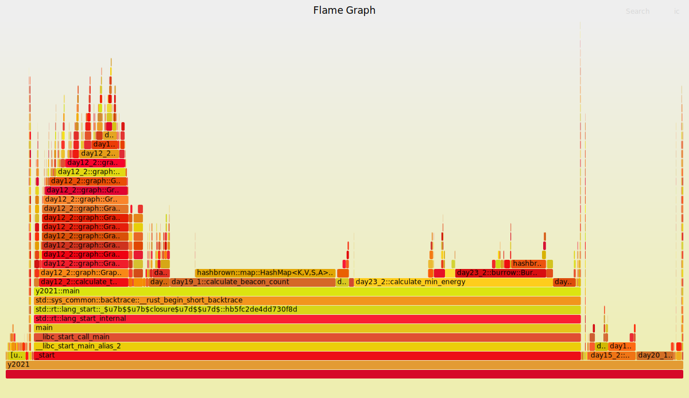

# Advent of Code 2021

https://adventofcode.com/2021

All puzzles solved in Rust - well except one (Day 23, part 1) that was solved
using pencil and paper!

Each day's puzzle or parts thereof are setup as a lib, with one main program 
that runs them all in sequence.

Inputs are read from the `resources` folder, except for Day 21 (where they are function
input variables set in `y2021/src/main.rs`) and Day 24 (where the key values from the input file
are setup as consts in `day24_1/src/lib.rs`).

Total execution time with `release` build as follows:

```
github/adventofcode/2021 $ time cargo run --release
    Finished release [optimized] target(s) in 0.03s
     Running `target/release/y2021`
...
<program outputs>
...
real    0m3.109s
user    0m3.014s
sys     0m0.056s
```

Did some minor performance tuning using perf and flamegraphs generated as follows:

```
github/adventofcode/2021 $ perf record --call-graph dwarf ./target/release/y2021
...
<program outputs>
...
[ perf record: Woken up 414 times to write data ]
[ perf record: Captured and wrote 103.535 MB perf.data (12855 samples) ]

github/adventofcode/2021 $ perf script | stackcollapse-perf.pl --all | flamegraph.pl  > flamegraph_final.svg
BFD: DWARF error: could not find variable specification at offset 0x3f74
BFD: DWARF error: could not find variable specification at offset 0x15ce
BFD: DWARF error: could not find variable specification at offset 0x32e0
BFD: DWARF error: could not find variable specification at offset 0x70c6
BFD: DWARF error: could not find variable specification at offset 0x176f
BFD: DWARF error: could not find variable specification at offset 0x1967
BFD: DWARF error: could not find variable specification at offset 0x3f81
BFD: DWARF error: could not find variable specification at offset 0x6cdc
BFD: DWARF error: could not find variable specification at offset 0x6ce7

```

The final flamegraph looks like this showing Day 19 (parts 1 and 2), Day 23 (part 2) and Day 12 (part 2) take up most of the execution time:


